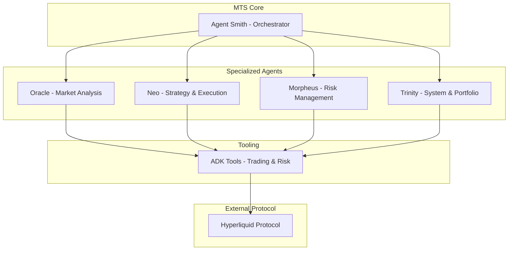

# Matrix Trading System (MTS)


An open-source, multi-agent framework for building automated trading strategies on the Hyperliquid platform, powered by Google's Agent Development Kit (ADK).

---

### 🚨 **Risk Warning** 🚨

⚠️ **This is experimental software. It is NOT financial advice.** ⚠️

Algorithmic trading is inherently risky and can lead to significant financial loss. The strategies and agents provided in this repository are for educational and research purposes only. You are solely responsible for any financial decisions you make.

🛑 **DO NOT USE THIS SOFTWARE WITH REAL MONEY UNLESS YOU FULLY UNDERSTAND THE RISKS AND HAVE THOROUGHLY TESTED YOUR CONFIGURATION.** 🛑

---

### System Architecture

The Matrix Trading System is orchestrated by `Agent Smith`, which directs a team of specialized agents to analyze market conditions, manage risk, and execute trades.



### Core Features

*   **Multi-Agent Architecture:** Inspired by the "Matrix," the system uses a team of specialized agents, each with a unique role, to handle complex trading workflows.
*   **Composable and Extensible:** Agents are defined by simple natural language prompts, making it easy to modify their behavior or add new agents to the system.
*   **Built with Google's ADK:** Leverages Google's Agent Development Kit for robust agent-to-agent communication, orchestration, and tool use.
*   **Hyperliquid Integration:** Designed specifically for the Hyperliquid DEX, providing a framework for building sophisticated, event-driven trading strategies.

### Setup and Installation

1.  **Clone the repository:**
    ```bash
    git clone <repository_url>
    cd mts
    ```

2.  **Install dependencies with Poetry:**
    ```bash
    poetry install
    ```

3.  **Configure your environment:**
    Copy the example `.env` file and add your API keys.
    ```bash
    cp .env.example .env
    ```
    You will need to add your `GOOGLE_API_KEY` and your Hyperliquid wallet's private key for the paper trading module.

    ```plaintext
    # .env
    GOOGLE_API_KEY="your_google_api_key"
    HYPERLIQUID_API_KEY="your_hyperliquid_api_key"
    HYPERLIQUID_SECRET_KEY="your_hyperliquid_secret_key"
    HYPERLIQUID_WALLET_ADDRESS="your_wallet_address"
    ```

### How to Run

To start the main orchestrator, run the following command:

```bash
python src/mts/main.py
```
*Note: The project uses MTS for configuration management. You can override parameters from the command line.*

### Roadmap: What's Next?

MTS is currently in a foundational stage. Here are the key features planned to make it a more complete and robust system:

*   **Advanced State Management:** Implement a persistent state manager (e.g., Redis or a database) to track agent decisions, trade history, and portfolio status across restarts.
*   **Live Trading Module:** Build out the non-paper-trading branch of the `TradingTools` to enable real capital deployment with proper error handling and safety checks.
*   **Strategy Backtesting Engine:** Develop a simulator to test agent prompts and trading strategies against historical Hyperliquid data, allowing for performance analysis before deployment.
*   **Web UI / Monitoring Dashboard:** Create a simple front-end (e.g., using Streamlit or FastAPI) to visualize the orchestrator's logs, agent responses, and portfolio performance in real-time.
*   **Community Contribution Guide:** Write a `CONTRIBUTING.md` file with guidelines for setting up a development environment, running tests, and submitting pull requests to encourage community involvement.

### License

This project is licensed under the MIT License. See the `LICENSE` file for details.
